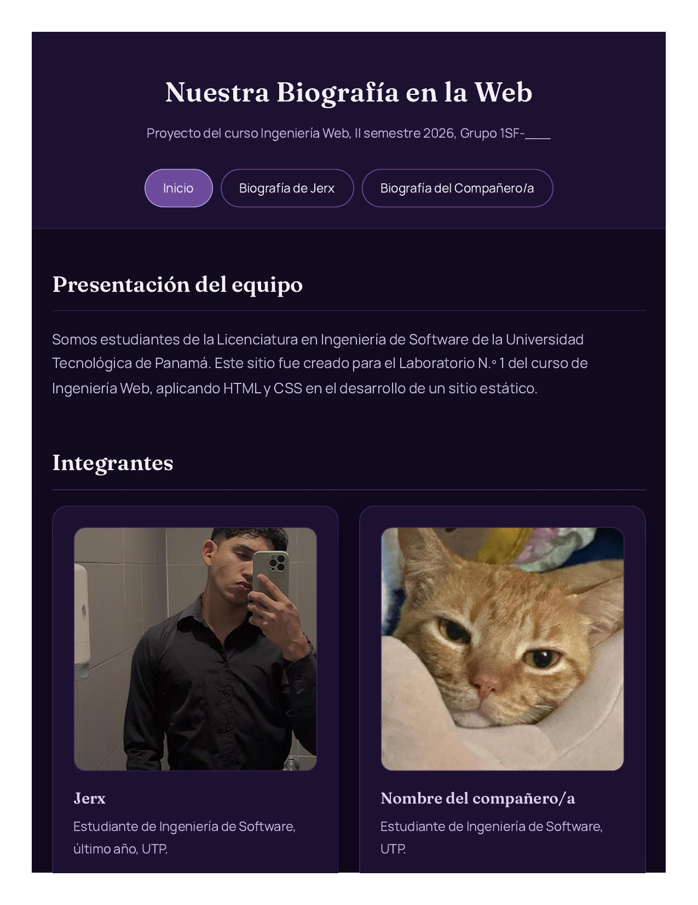
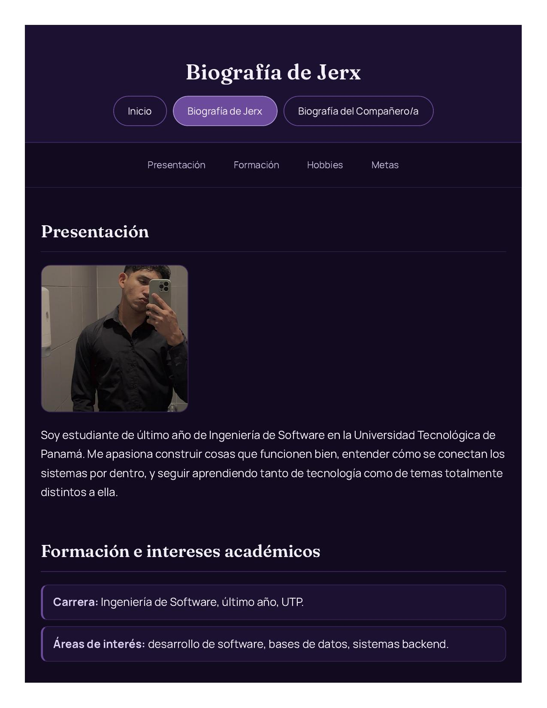
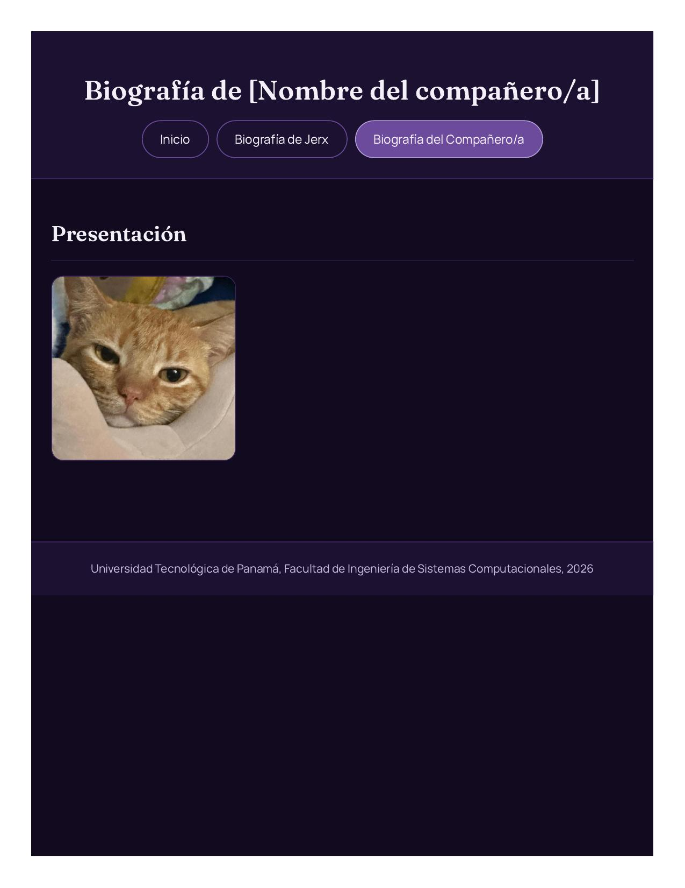

# Nuestra Biografía en la Web

Laboratorio N.º 1 del curso de Ingeniería Web — Universidad Tecnológica de Panamá, Facultad de Ingeniería de Sistemas Computacionales, II semestre 2026.

Sitio estático en HTML y CSS que presenta la biografía de los integrantes del equipo, con navegación entre páginas y un menú por secciones dentro de cada biografía.

**Sitio publicado:** https://jimyplay.github.io/lab1-iweb-biografia/

## Estructura del proyecto

```
.
├── index.html
├── biografia1.html
├── biografia2.html
├── css/
│   └── estilos.css
└── img/
```

## Capturas

### Página principal



### Biografía de Jerx



### Biografía del compañero/a



## Tecnologías

- HTML5 semántico (`header`, `nav`, `main`, `section`, `article`, `footer`)
- CSS externo, paleta monocromática en morado con tipografías Fraunces (títulos) y Manrope (texto)
- JavaScript puro para resaltar la sección activa en el menú de navegación interno
